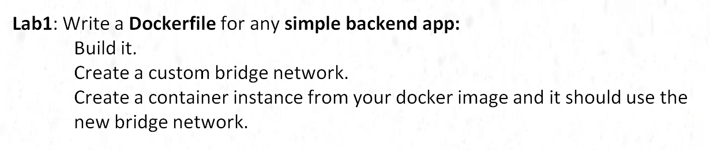
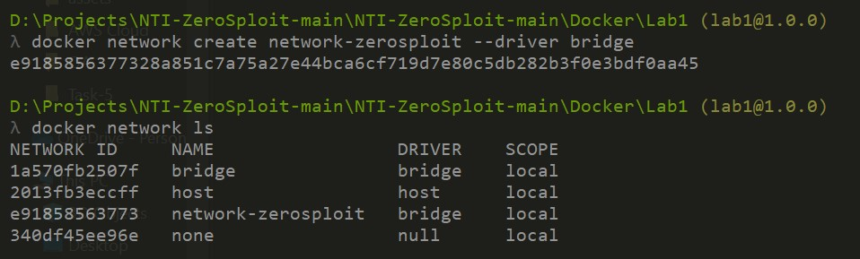
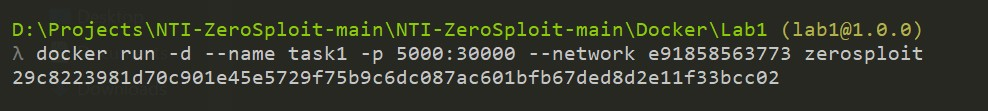

# 🚀 Simple Back-End App with Docker 🐳

## 🏗️ Architecture


---

## 🔹 Step 1: Build the Backend Application 🛠️

### 📌 Using Node.js
```bash
# Initialize a new Node.js project 📦
npm init -y  

# Install Express framework 🚀
npm install express  

# Run the application locally 🏃‍♂️
node app.js  
```

---

## 🔹 Step 2: Prepare the Docker Image 🐳
```bash
# Build a Docker image from the Dockerfile 🏗️
docker build -t zerosploit .
```

---

## 🔹 Step 3: Create a Custom Bridge Network 🌉
```bash
# Create a custom Docker network 🔗
docker network create network-zerosploit --driver bridge
```


---

## 🔹 Step 4: Run the Container Using the Custom Network 🚢
```bash
# Run the container with the custom network and port mapping 🔄
docker run -d --name task1 -p 5000:30000 --network network-zerosploit zerosploit
```


---

## 🎯 Final Output ✅
### 🔥 Access the App via Port 5000 & Enable Container Communication


🎉 **Your simple back-end app is now running inside a Docker container** 🚀

