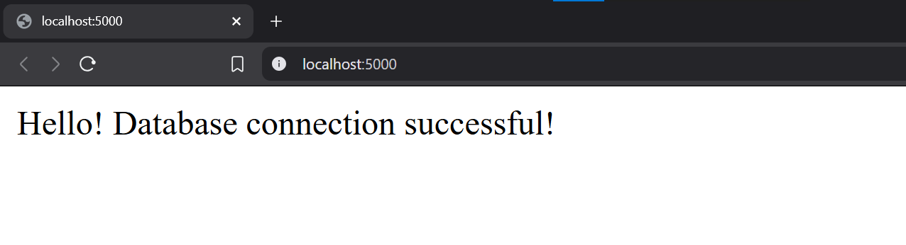

# 🐳 Dockerized Flask-PostgreSQL Web Application

[](https://www.docker.com/)
[](https://www.python.org/)
[](https://flask.palletsprojects.com/)
[](https://www.postgresql.org/)

---

## 🌍 Project Overview
This project demonstrates **containerization** of a **Flask-Python web application** with a **PostgreSQL database** using **Docker** and **Docker Compose**. 🚀

### 📌 Key Features:
✅ Flask (Python) web server 🐍

✅ PostgreSQL database 🗄️

✅ Docker containerization 🐳

✅ Persistent database storage using Docker volumes 💾

✅ Docker Compose for easy orchestration ⚙️

---

## 🔧 Prerequisites
- [Docker](https://docs.docker.com/get-docker/)
- [Docker Compose](https://docs.docker.com/compose/install/)
- Any text editor (VS Code, Sublime, etc.)

---

## 📂 Project Structure
```bash
├── Dockerfile                # Web service configuration 🏗️
├── docker-compose.yml        # Docker Compose setup 🛠️
├── app.py                    # Flask application 🌐
└── postgres_data/            # Auto-created volume for PostgreSQL 🔄
```

---

## 🚀 Setup Steps

### 1️⃣ Clone the Repository 📝
```bash
git clone https://github.com/abdelhamed-4A/NTI-ZeroSploit-Training.git
cd Lab2
```

### 2️⃣ Configure Dockerfile 🐳
📌 **Key Features:**
- Uses **official Python 3.9 slim** image 🐍
- Installs required dependencies 📦
- Copies application code (`app.py`) 📝
- Exposes **port 5000** for Flask 🌐
- Runs Flask app listening on all interfaces 🎯

### 3️⃣ Configure Docker Compose ⚙️
📌 **Key Components:**

✅ **Web Service:**
- Builds from local **Dockerfile** 🏗️
- Maps host port **5000** → container port **5000** 🔗
- Connects to PostgreSQL using **environment variables** 🌍
- Depends on **PostgreSQL database service** 🛠️

✅ **Database Service:**
- Uses **PostgreSQL 13** official image 🗄️
- Persistent volume for **data storage** 💾
- Pre-configured **credentials:**
  - **User:** `appuser`
  - **Password:** `apppass`
  - **Database:** `appdb`

### 4️⃣ Configure Flask Application 🐍
📌 **File: `app.py`**

✅ **Functionality:**
- Simple **endpoint (`/`)** that tests database connectivity 🔄
- Uses `psycopg2` for **PostgreSQL connection** 🔗
- Returns **connection status message** ✅

---

## 🔥 Deployment
### 💻 Start the Application
```bash
# Build and start the containers 🚀
docker-compose up --build

# Stop containers (CTRL+C to stop in foreground)
docker-compose down
```

---

## ✅ Verification
### 1️⃣ Access the Web Application 🌐
```bash
http://localhost:5000
```

### 2️⃣ Expected Response 📸


🎉 **Congratulations! Your Flask-PostgreSQL app is now running inside Docker** 🐳🔥

