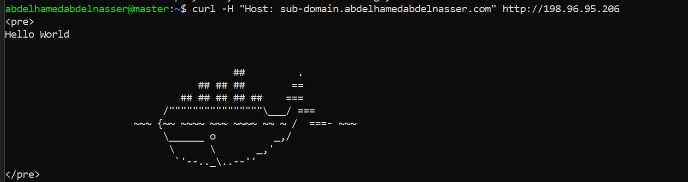
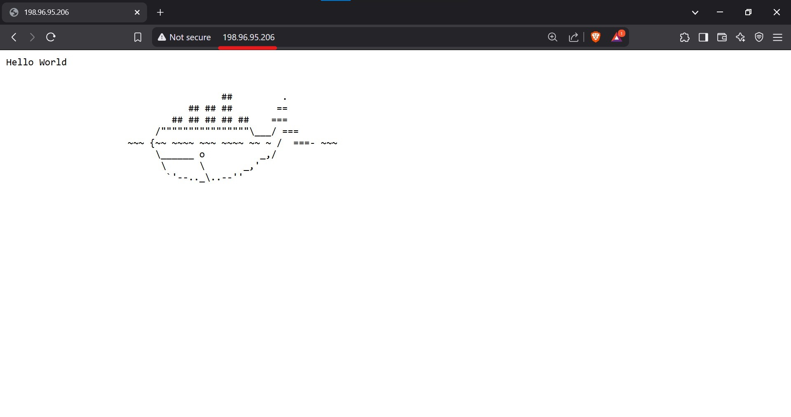
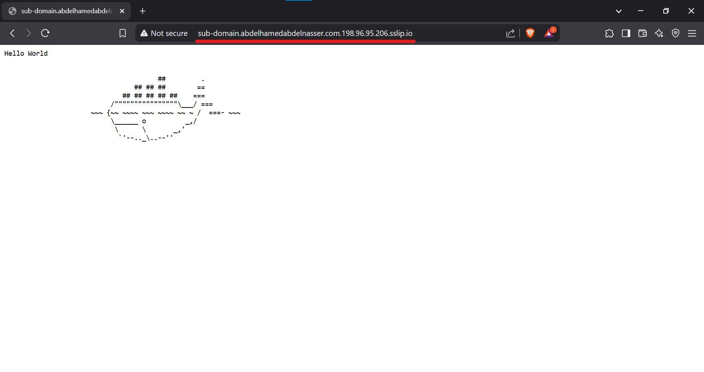

# Hello World Kubernetes Deployment

This project demonstrates how to deploy a simple "Hello World" application using Kubernetes. It includes:

- A **Deployment** to run the `crccheck/hello-world` Docker image.
- A **Service** to expose the application internally.
- An **Ingress** to route external traffic to the service using a custom domain.

## Prerequisites

- A Kubernetes cluster with an **NGINX Ingress Controller** installed.
- `kubectl` configured to access your cluster.

---

## Deployment Steps

### 1. Create the Deployment
The deployment runs the `crccheck/hello-world` image and exposes port **8000**.

```yaml
apiVersion: apps/v1
kind: Deployment
metadata:
  name: hello-world-deployment
spec:
  replicas: 1
  selector:
    matchLabels:
      app: hello-world
  template:
    metadata:
      labels:
        app: hello-world
    spec:
      containers:
      - name: hello-world-container
        image: crccheck/hello-world
        ports:
        - containerPort: 8000
```
Apply the deployment:
```bash
kubectl apply -f deployment.yaml
```

### 2. Create the Service
The service exposes the deployment internally on port **80** and routes traffic to the pods on port **8000**.

```yaml
apiVersion: v1
kind: Service
metadata:
  name: hello-world-service
spec:
  selector:
    app: hello-world
  ports:
    - protocol: TCP
      port: 80
      targetPort: 8000
```
Apply the service:
```bash
kubectl apply -f service.yaml
```

### 3. Create the Ingress
The ingress routes external traffic to the service using the domain **sub-domain.abdelhamedabdelnasser.com**.

```yaml
apiVersion: networking.k8s.io/v1
kind: Ingress
metadata:
  name: hello-world-ingress
spec:
  ingressClassName: nginx
  rules:
  - host: sub-domain.abdelhamedabdelnasser.com
    http:
      paths:
      - path: /
        pathType: Prefix
        backend:
          service:
            name: hello-world-service
            port:
              number: 80
```
Apply the ingress:
```bash
kubectl apply -f ingress.yaml
```

---

## Testing the Application

### 1. Using kubectl port-forward
You can forward a local port to the service for testing:
```bash
kubectl port-forward svc/hello-world-service 8080:80
```
Then, open your browser or use `curl` to access:
```bash
http://localhost:8080
```

### 2. Testing the Ingress
#### Method 1: Use curl with a Custom Host Header
```bash
curl -H "Host: sub-domain.abdelhamedabdelnasser.com" http://198.96.95.206
```


#### Method 2: Use a Browser Extension
- Install **ModHeader** (Chrome/Edge) and add a custom header:
  - **Header Name:** Host
  - **Header Value:** sub-domain.abdelhamedabdelnasser.com
- Navigate to: `http://198.96.95.206`


#### Method 3: Use a Temporary DNS Service
Use a service like `sslip.io` or `nip.io` to resolve the domain:
```bash
http://http://sub-domain.abdelhamedabdelnasser.com.198.96.95.206.sslip.io/
```

---

## Verify Resources
Check the status of your resources:
```bash
kubectl get deployment hello-world-deployment
kubectl get service hello-world-service
kubectl get ingress hello-world-ingress
```

## Clean Up
To delete all resources:
```bash
kubectl delete -f deployment.yaml
kubectl delete -f service.yaml
kubectl delete -f ingress.yaml
```

---

## Notes
- Replace `68.168.208.125` with the actual IP address of your ingress.
- Ensure your **DNS** or `/etc/hosts` is configured correctly if using a custom domain.