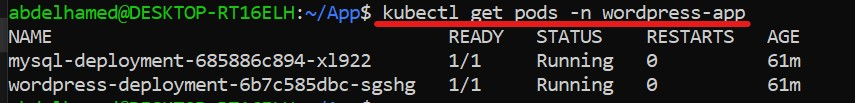
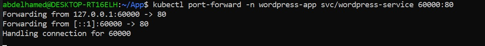
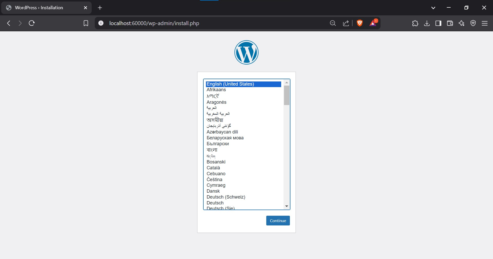
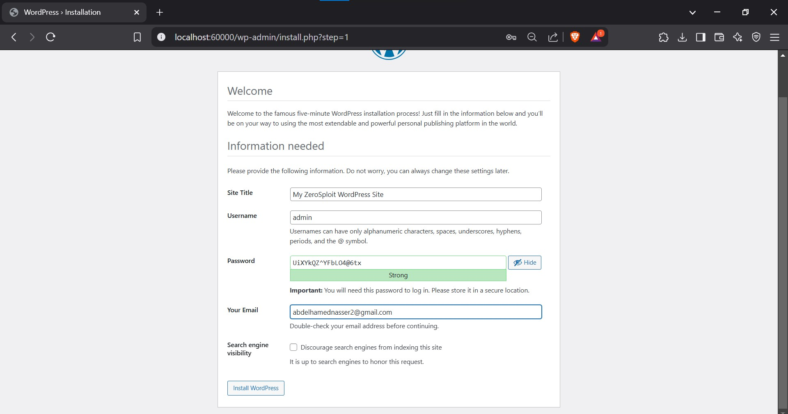
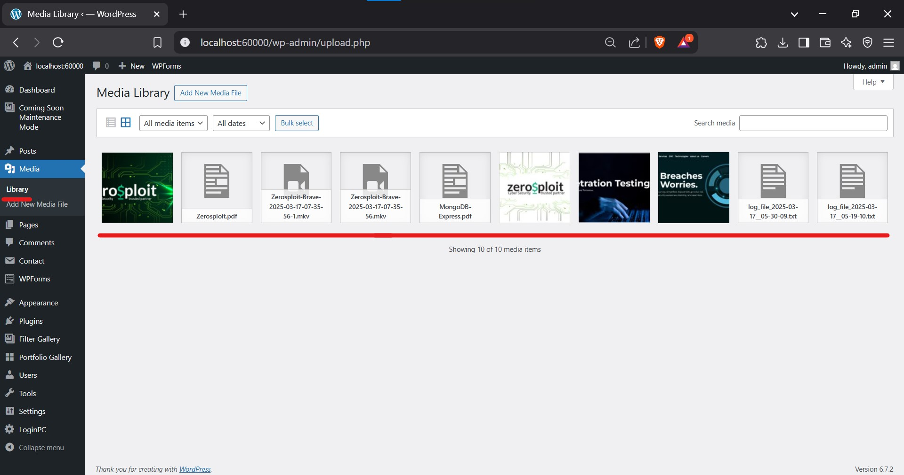
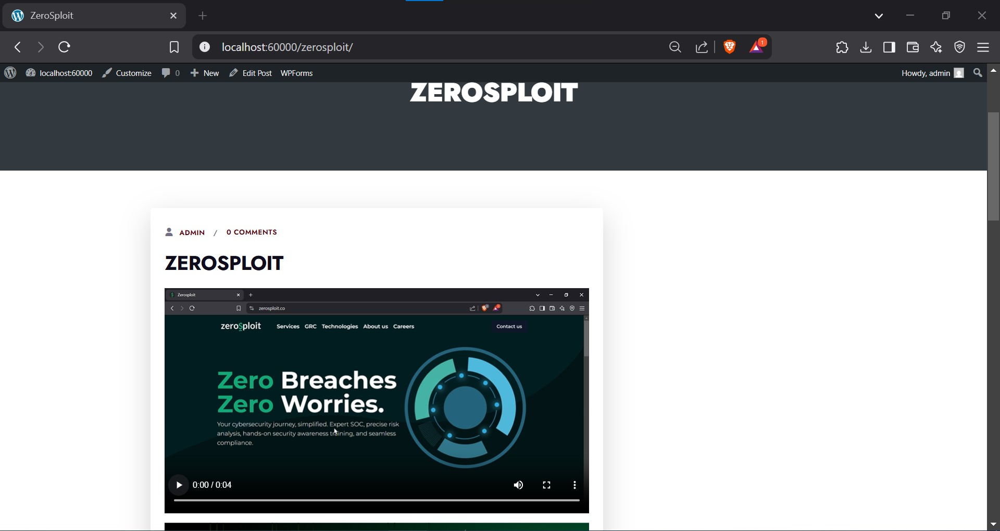
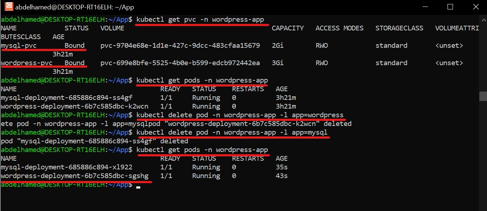
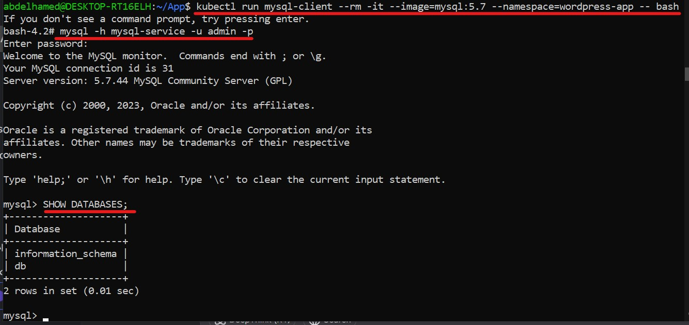

# 📌 Deploying WordPress on Kubernetes with MySQL

This guide walks you through deploying a **WordPress** application with **MySQL** in a **Kubernetes cluster**. It includes **persistent storage** for the database and static content, ensuring data is not lost when containers restart. 🚀

---

## 🏰 Architecture

The deployment consists of:

✅ **MySQL** as the database (with Persistent Storage).  
✅ **WordPress** as the frontend & backend (with Persistent Storage).  
✅ **Persistent Volume Claims (PVCs)** for **database storage** and **static content**.  
✅ **Secrets** for secure database credentials.  
✅ **Kubernetes Services** for internal and external connectivity.

---

## 📌 Steps to Deploy

### 1️⃣ Create a Namespace (Optional but Recommended)
```yaml
apiVersion: v1
kind: Namespace
metadata:
  name: wordpress-app
```
Apply the namespace:
```bash
kubectl apply -f namespace.yaml
```

---

### 2️⃣ Create a Secret for MySQL Credentials
Store MySQL credentials securely as a **Kubernetes Secret**.
```yaml
apiVersion: v1
kind: Secret
metadata:
  name: mysql-secret
  namespace: wordpress-app
type: Opaque
data:
  mysql-root-password: U2VjdXJlUGFzczEyMyE=    # SecurePass123! (base64 encoded)
  mysql-database: ZGI=                         # db (base64 encoded)
  mysql-username: YWRtaW4=                     # admin (base64 encoded)
  mysql-password: U2VjdXJlUGFzczEyMyE=         # SecurePass123! (base64 encoded)
```
🎡 **Note:** Use `echo -n 'your-secret' | base64` to encode secrets.

Apply the Secret:
```bash
kubectl apply -f mysql-secret.yaml
```

---

### 3️⃣ Create Persistent Volume Claims (PVCs)
#### **PVC for MySQL**
```yaml
apiVersion: v1
kind: PersistentVolumeClaim
metadata:
  name: mysql-pvc
  namespace: wordpress-app
spec:
  accessModes:
    - ReadWriteOnce
  resources:
    requests:
      storage: 2Gi
```
#### **PVC for WordPress**
```yaml
apiVersion: v1
kind: PersistentVolumeClaim
metadata:
  name: wordpress-pvc
  namespace: wordpress-app
spec:
  accessModes:
    - ReadWriteOnce
  resources:
    requests:
      storage: 5Gi
```
Apply the PVCs:
```bash
kubectl apply -f mysql-pvc.yaml
kubectl apply -f wordpress-pvc.yaml
```

---

### 4️⃣ Deploy MySQL Database
```yaml
apiVersion: apps/v1
kind: Deployment
metadata:
  name: mysql-deployment
  namespace: wordpress-app
spec:
  selector:
    matchLabels:
      app: mysql
  template:
    metadata:
      labels:
        app: mysql
    spec:
      containers:
      - name: mysql
        image: mysql:5.7
        env:
        - name: MYSQL_ROOT_PASSWORD
          valueFrom:
            secretKeyRef:
              name: mysql-secret
              key: mysql-root-password
        - name: MYSQL_DATABASE
          valueFrom:
            secretKeyRef:
              name: mysql-secret
              key: mysql-database
        - name: MYSQL_USER
          valueFrom:
            secretKeyRef:
              name: mysql-secret
              key: mysql-username
        - name: MYSQL_PASSWORD
          valueFrom:
            secretKeyRef:
              name: mysql-secret
              key: mysql-password
        ports:
        - containerPort: 3306
        volumeMounts:
        - name: mysql-storage
          mountPath: /var/lib/mysql
      volumes:
      - name: mysql-storage
        persistentVolumeClaim:
          claimName: mysql-pvc
```
Apply the MySQL Deployment:
```bash
kubectl apply -f mysql-deployment.yaml
```

#### **MySQL Service (ClusterIP)**
```yaml
apiVersion: v1
kind: Service
metadata:
  name: mysql-service
  namespace: wordpress-app
spec:
  selector:
    app: mysql
  ports:
    - port: 3306
      targetPort: 3306
```
Apply the MySQL Service:
```bash
kubectl apply -f mysql-service.yaml
```

---

### 5️⃣ Deploy WordPress
```yaml
apiVersion: apps/v1
kind: Deployment
metadata:
  name: wordpress-deployment
  namespace: wordpress-app
spec:
  selector:
    matchLabels:
      app: wordpress
  template:
    metadata:
      labels:
        app: wordpress
    spec:
      containers:
      - name: wordpress
        image: wordpress:latest
        ports:
        - containerPort: 80
        env:
        - name: WORDPRESS_DB_HOST
          value: mysql-service
        - name: WORDPRESS_DB_USER
          valueFrom:
            secretKeyRef:
              name: mysql-secret
              key: mysql-username
        - name: WORDPRESS_DB_PASSWORD
          valueFrom:
            secretKeyRef:
              name: mysql-secret
              key: mysql-password
        - name: WORDPRESS_DB_NAME
          valueFrom:
            secretKeyRef:
              name: mysql-secret
              key: mysql-database
        volumeMounts:
        - name: wordpress-storage
          mountPath: /var/www/html
      volumes:
      - name: wordpress-storage
        persistentVolumeClaim:
          claimName: wordpress-pvc
```
Apply the WordPress Deployment:
```bash
kubectl apply -f wordpress-deployment.yaml
```

#### **WordPress Service (NodePort)**
```yaml
apiVersion: v1
kind: Service
metadata:
  name: wordpress-service
  namespace: wordpress-app
spec:
  type: NodePort
  selector:
    app: wordpress
  ports:
    - port: 80
      targetPort: 80
```
Apply the WordPress Service:
```bash
kubectl apply -f wordpress-service.yaml
```

---

## 🔄 Verify Deployment & Data Persistence

### ✅ Check Running Pods
```bash
kubectl get pods -n wordpress-app
```


### ✅ Access WordPress Locally
Forward the port to your local machine:
```bash
kubectl port-forward -n wordpress-app svc/wordpress-service 60000:80
```


Then open:  
📌 **http://localhost:60000**
in your browser to access WordPress.




### ✅ Test Data Persistence
1️⃣ Upload images, videos and docs & create posts in WordPress. 




2️⃣ Delete the WordPress pod:
```bash
kubectl delete pod -n wordpress-app -l app=wordpress
kubectl delete pod -n wordpress-app -l app=mysql
```


3️⃣ Verify that the data is still available after the pods restart.

open the localhost again and you will find all the data:  
📌 **http://localhost:60000**

### ✅ Test MySQL Connectivity and ensure that your WordPress application can communicate with the MySQL database
Run the following command to start a MySQL client pod and connect to the MySQL database:
```bash
kubectl run mysql-client --rm -it --image=mysql:5.7 --namespace=wordpress-app -- bash
```
Inside the MySQL client pod, run the following command to connect to the MySQL database:
```bash
mysql -h mysql-service -u root -p
```
When prompted for the password, enter the decoded value of mysql-root-password:
```bash
SecurePass123!
```
Once connected, you can run SQL commands to verify the connection. For example:
```sql
SHOW DATABASES;
```

---

## 🎉 Success! You Have Deployed WordPress on Kubernetes 🚀
Your WordPress site is now live in Kubernetes with a persistent **MySQL database** and **stored media files** 🏆🎊