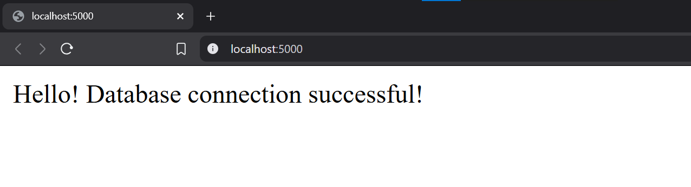

# Dockerized Flask-PostgreSQL Web Application

[](https://www.docker.com/)
[](https://www.python.org/)
[](https://flask.palletsprojects.com/)
[](https://www.postgresql.org/)

## Project Overview
This project demonstrates containerization of a Python/Flask web application with a PostgreSQL database using Docker and Docker Compose. It includes:
- Flask (Python) web server
- PostgreSQL database
- Docker containerization
- Persistent storage for database using Docker volumes
- Docker Compose orchestration

## Prerequisites
- [Docker](https://docs.docker.com/get-docker/)
- [Docker Compose](https://docs.docker.com/compose/install/)
- Text editor (VS Code, Sublime, etc.)

## Project Structure
```bash
├── Dockerfile                # Web service configuration
├── docker-compose.yml        # Orchestration setup
├── app.py                    # Flask application
└── postgres_data/            # Auto-created volume
```

## Setup Steps

### 1. Dockerfile Configuration

**Key Features:**
- Uses official Python 3.9 slim image
- Installs required system dependencies
- Copies application code (`app.py`)
- Exposes port 5000 for Flask
- Configures Flask to listen on all interfaces

### 2. Docker Compose Configuration
**File: `docker-compose.yml`**

**Key Components:**
1. **Web Service:**
   - Builds from local `Dockerfile`
   - Maps host port `5000` → container port `5000`
   - Connects to the database using environment variables
   - Depends on the database service

2. **Database Service:**
   - Uses PostgreSQL 13 image
   - Persistent volume for data storage
   - Pre-configured credentials:
     - **User:** `appuser`
     - **Password:** `apppass`
     - **Database:** `appdb`

### 3. Flask Application
**File: `app.py`**

**Functionality:**
- Simple endpoint (`/`) that tests database connectivity
- Uses `psycopg2` for PostgreSQL connection
- Returns connection status message

## Deployment
### Command Line Execution
```bash
# Build and start containers
docker-compose up --build

# Stop containers (CTRL+C to stop in foreground)
docker-compose down
```

## Verification
1. **Access the application:**
   ```bash
   http://localhost:5000
   ```
2. **Successful response:**

   


