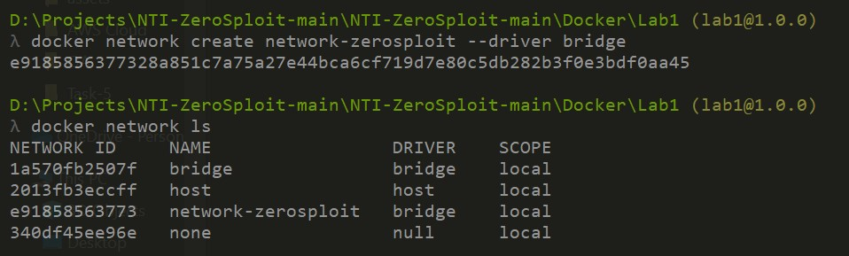
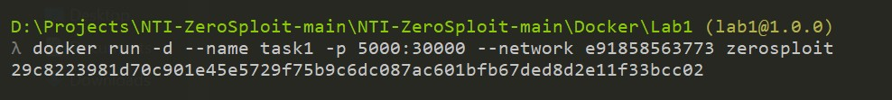
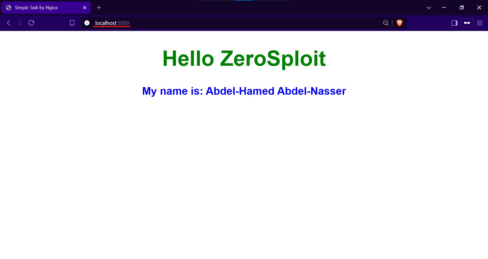

# Lab1: Simple BackEnd App with Docker

## Architecture


## Step 1: Build the Backend Application

### Using Node.js
```bash
# Initialize a new Node.js project
npm init -y  

# Install Express framework
npm install express  

# Run the application locally
node app.js  
```

## Step 2: Prepare the Docker Image
```bash
# Build a Docker image from the Dockerfile
docker build -t zerosploit .
```

## Step 3: Create a Custom Bridge Network
```bash
# Create a custom Docker network
docker network create network-zerosploit --driver bridge
```


## Step 4: Run the Container using the Custom Network
```bash
# Run the container with the custom network and port mapping
docker run -d --name task1 -p 5000:30000 --network e91858563773 zerosploit
```


## Final Output
### We can now access the app through port 5000 and the container can communicate with other containers on the zerosploit network. 

