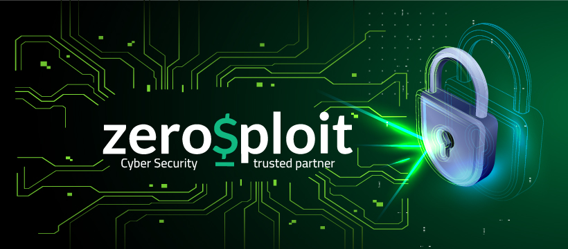

# 🚀 NTI ZeroSploit Training Journey

## 📌 Overview
Welcome to the **NTI ZeroSploit Training Repository** 🎯
This repository documents my journey through the **ZeroSploit training program**, highlighting completed tasks, projects, and hands-on experience with cutting-edge **DevOps technologies**.

## 🔹 Technologies Covered
- 🐳 **Docker** – Containerization & Orchestration
- ☸️ **Kubernetes** – Scalable Deployment & Management
- 📂 Each section contains structured **labs, guides, and real-world exercises** 📖

## 📂 Repository Structure
```
📦 NTI-ZeroSploit-Training
├── 🐳 Docker
│   ├── Lab1-Simple Back-End App with Docker
│   └── Lab2-Dockerized Flask-PostgreSQL Web Application
│
├── ☸️ Kubernetes
│   ├── Lab1-K8s-Deployment
│   └── Lab2-K8s-Services
│
└── 📜 README.md
```

## 🙌 Acknowledgments
🎉 A huge thank you to:
✅ **NTI** for this exceptional training opportunity.
✅ **ZeroSploit Program** for providing practical, hands-on experience.

🚀 **Onward to mastering DevOps** 🔥

